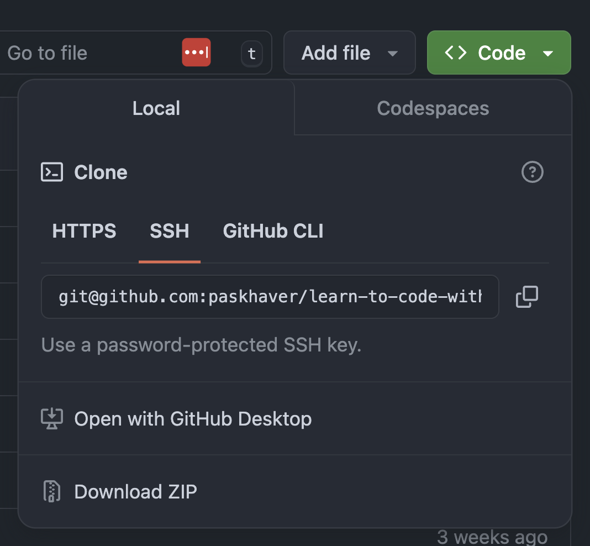
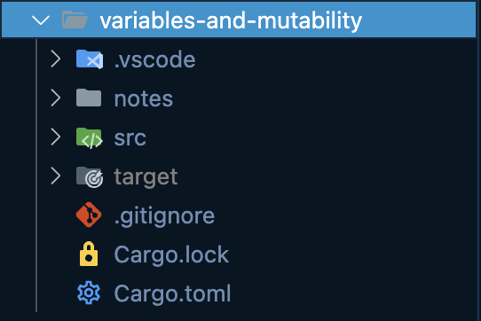
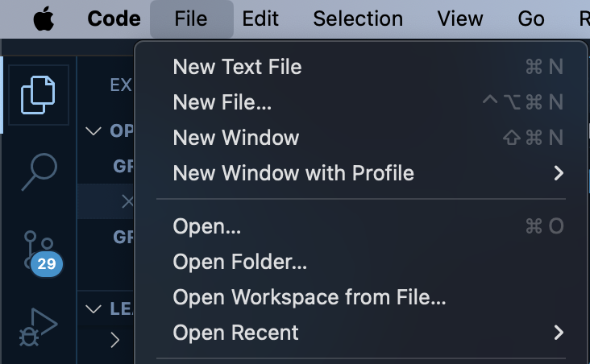

# Learn to Code with Rust 📚


Welcome! These are the course materials for the **Learn to Code with Rust** course.

---

## 📖 Book Index (Chapters)

Each folder below is a chapter or section. Open the folder for notes, code, and exercises.

### Absolute Beginner
- [Getting Started](getting-started/) — Rust basics, main function, println!, compiling, and formatting.
- [Project Structure](project-structure/) —
    - `cargo_and_project_structure.rs`: Using Cargo, project layout, and build commands
    - `cargo_toml.rs`: Manifest file, TOML syntax, and dependencies
    - `crates_packages_modules.rs`: Code organization, modules, and crate types
- [Compilation](compilation/) —
    - `compilation_notes.rs`: How Rust compiles to native binaries and cross-compilation
    - `compiler_directives.rs`: Attributes, file/function/line-level directives, and suppressing warnings
- [Visibility and Access Control](visibility/) — pub, self, super, crate, and module privacy.
- [use, mod, crate Mechanics](use-mod-crate/) — Module inclusion and bringing items into scope.
- [Rust Errors](rust-errors/) — Understanding compiler errors and error explanations.

### Core Rust Concepts
- [variables-and-mutability/](variables-and-mutability/) — Variables, mutability, shadowing, scope, constants, type alias, and string interpolation.
- [control-flow/](control-flow/) — if, else, match, loops, and branching.
- [data-types/](data-types/) — Primitive types, custom types, and conversions.
- [functions/](functions/) — Defining and using functions.
- [ownership/](ownership/) — Ownership, borrowing, and lifetimes.
- [option-and-result-enums/](option-and-result-enums/) — Option, Result, and error handling.
- [error-handling/](error-handling/) — Patterns for handling errors.
- [vectors/](vectors/) — Working with dynamic arrays.
- [hash-maps/](hash-maps/) — Key-value storage and usage.
- [strings/](strings/) — String types and manipulation.
- [slices/](slices/) — Slices and referencing data.
- [enums/](enums/) — Enum types and pattern matching.
- [structs/](structs/) — Structs and data organization.
- [traits/](traits/) — Traits and polymorphism.
- [generics/](generics/) — Generic types and functions.
- [lifetimes/](lifetimes/) — Lifetime annotations and advanced borrowing.
- [iterators/](iterators/) — Iterator patterns and usage.
- [random/](random/) — Generating random numbers.
- [datetimes/](datetimes/) — Working with dates and times.
- [regular-expressions/](regular-expressions/) — Regex in Rust.
- [smart-pointers-box/](smart-pointers-box/) — Box, smart pointers, and heap allocation.
- [testing/](testing/) — Writing and running tests.

### Practice & Projects
- [saladworks/](saladworks/) — Project-based learning.
- [warehouse/](warehouse/) — Project-based learning.

---

## 📦 How to Use This Book

- Open any chapter folder in VSCode or your editor.
- Each folder is an independent Cargo project (with its own `Cargo.toml`).
- Run code with `cargo run` inside the folder.
- Explore notes, code, and exercises in each section.

## Setup & Download

To download the content, you can either clone this repository with Git or download the repository manually. A repository (or repo) is a technical term for a project managed by Git.

### To clone repository with Git:

In Terminal/PowerShell, navigate to the directory where you'd like to download the `learn-to-code-with-rust` course materials. 

Execute `git clone git@github.com:paskhaver/learn-to-code-with-rust.git` to clone the repository to your computer.

### To download repository:

On this GitHub page, click the green `Code` button, then select "Download ZIP". Unpack the zip and move the `learn-to-code-with-rust` directory to wherever you'd like.



## Working Through the Course

The `learn-to-code-with-rust` folder contains multiple directories. Each folder is an independent Cargo project with a  `Cargo.toml` file.

At the start of each course section, you'll find a note listing the Cargo project for that course.

For example, the next section is called "Variables and Mutability" and has a corresponding `variables-and-mutability` folder.



Open up the section's folder in VSCode. There are two ways to accomplish this:

- In VSCode, access the main menu. Select `File > Open Folder...`. Locate the section's project folder on your file system and select it.



- In Terminal/PowerShell, navigate into the section's folder with the `cd` command. Then, open the folder in VSCode with `code .`

```sh
$ cd variables-and-mutability
$ code .
```
